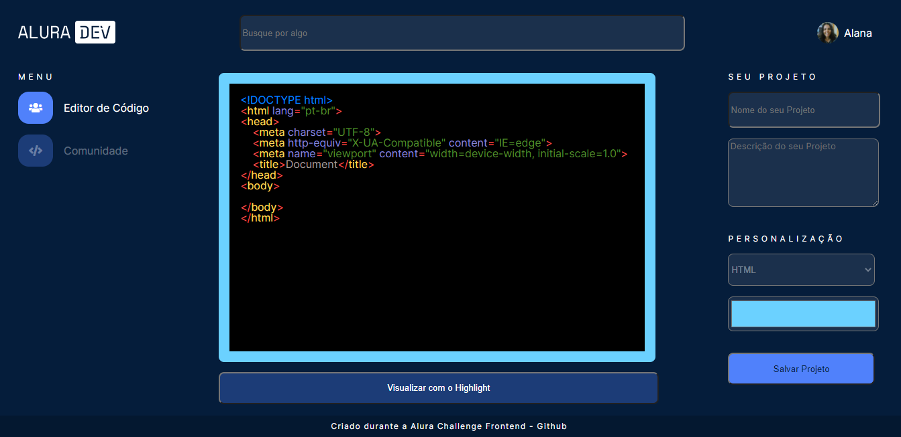

<h1 align="center">
     AluraDev - criado durante o 
     <a href="https://www.alura.com.br/challenges/front-end" alt="Site do Challenge da Alura">
        Challenge Frontend - 1ª edição - da Alura
     </a>
</h1>

## 🖼️ Imagem do projeto

   

---

## 💻 Sobre o projeto

O projeto AluraDev foi desenvolvido durante o Challenge Frontend da Alura, que contou com 4 semanas para a criação do projeto, com sprints e layout no figma por 3 semanas, como se fosse um ambiente de trabalho real.

[Acessar o Projeto](https://aluradev-challengefrontend.vercel.app/)

---

## 🛠 Tecnologias

As seguintes linguagens foram usadas na construção do projeto:

-   [HTML](https://developer.mozilla.org/pt-BR/docs/Web/HTML)
-   [CSS](https://developer.mozilla.org/pt-BR/docs/Web/CSS)
-   [JavaScript](https://developer.mozilla.org/pt-BR/docs/Web/JavaScript)

---

Desenvolvido por [Alana Bacco](https://github.com/alanabacco).  
